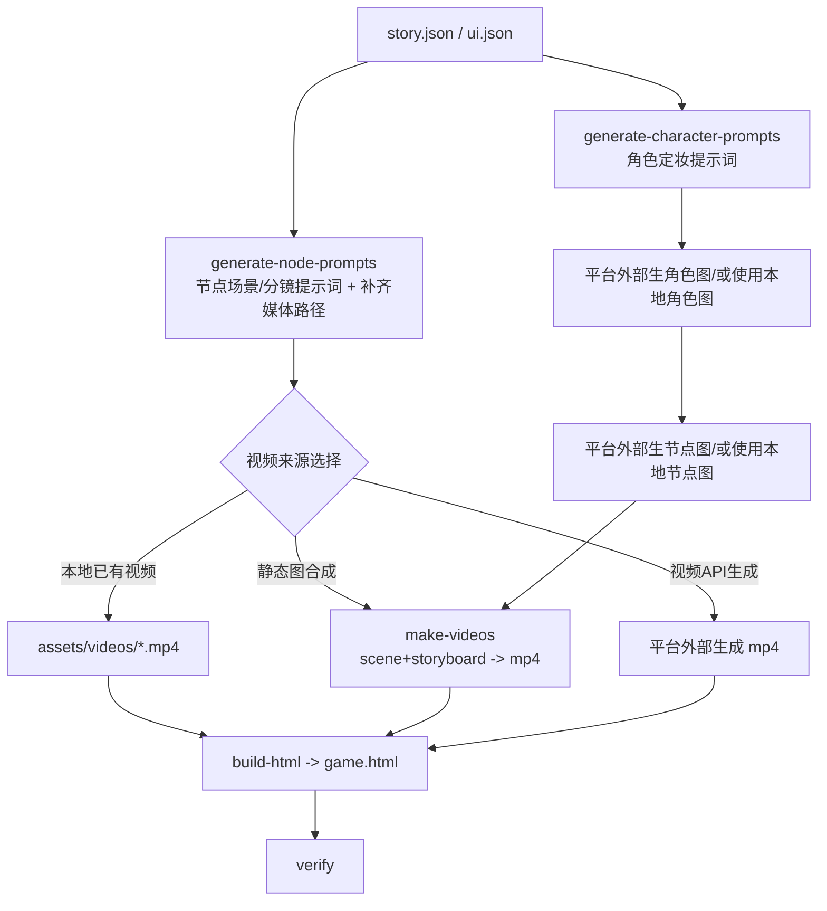

# IP-GAME（Codex 标准 Skill）

IP-GAME 的核心不是“直接替你调用 AI 生图/生视频”，而是一套**本地可落地的工具链**：把 `story.json/ui.json` 组织成可试玩的 `game.html`，并提供“提示词生成 + 静态图合成视频 + 资产自检”的闭环，让你在任何平台都能按同一套流程跑通。

---

## 工作机制

1. 读取 `story.json / ui.json`
2. 给角色生成“定妆多视角提示词”（不限物种，支持“本地角色图优先”）
3. 给每个剧情节点生成：
   - 场景图 prompt
   - 九宫格分镜图 prompt
4. 按素材路径补齐 `sceneImage / storyboardImage / videoRefImage / video`
5. 用本地 ffmpeg 把静态图合成为节点 `mp4`（可选，不触网）
6. 把剧情、UI、素材路径打包成可离线试玩的 `game.html`
7. 用 `verify` 检查图片/视频是否缺失或不可播放

---

## 你必须保留的“选择路径”

本仓库本身不强绑定任何云端 API，但 **Skill 标准流程必须向用户提供这些选择**（你的平台/Agent 需要在对话里问清楚）：

对话式流程与“问用户的问题模板”已固化在 `INTERACTION.md`，建议平台直接照此执行（6 次询问体系）。

### 角色图来源（二选一，强制确认）
1. `直接生成`：用你平台的生图能力生成角色定妆图
2. `使用本地已有角色图`：用户已有角色三视图/设定图/参考图（此时必须优先本地素材，禁止重新设计角色）

### 节点场景图与故事板图来源（二选一，强制确认）
1. `直接生成`：用你平台的生图能力生成 `sceneImage` 与 `storyboardImage`
2. `使用本地已有图片`：用户提供节点图片素材（直接映射路径）

### 视频来源（三选一，强制确认）
1. `视频 API 生成`：由平台侧执行（仓库不内置 provider；密钥不得入库）
2. `使用本地已有视频`：用户提供 mp4（直接放到 `assets/videos/`）
3. `静态图合成视频`：使用本仓库 `make-videos` 在本地合成 mp4（推荐测试/保底）

---

## 输入与输出约定

### 输入（项目目录）

```text
<project>/
  story.json
  ui.json                 # 可选；缺省时仍可 build-html
  assets/
    images/
      scenes/
      storyboards/
      endings/
      characters/
    videos/
```

### 输出

- `<project>/game.html`
- `<project>/assets/videos/<节点ID>.mp4`（可选：静态合成生成）
- `story.json`（可选：执行 generate-* 时会补写提示词与默认路径）

---

## CLI 工具（唯一入口）

安装：

```bash
pip install .
```

命令：

```text
ip-game build-html <project-dir> [--story story.json] [--ui ui.json]
ip-game make-videos <project-dir> [--story story.json] [--only N0,E0] [--skip-existing] [--size 1280x720]
ip-game verify <project-dir> [--story story.json]
ip-game generate-node-prompts <project-dir> [--story story.json]
ip-game generate-character-prompts <project-dir> [--story story.json]
```

---

## 流程图（本地工具链）



---

## “节点提示词”清单（给平台对接用）

这些提示词不是固定文本，而是**公式/模板**，由仓库命令生成并写回 `story.json`，供你平台调用外部生图能力时直接取用。

### 节点：角色定妆提示词

命令：
```bash
ip-game generate-character-prompts <project-dir>
```

写入位置：
- `story.json.characters[].characterSheetPrompt`
- `assets/prompts/characters/<角色ID>_sheet.txt`（如果你项目保留此目录）

模板文件（不限物种）：
- `src/ip_game/prompts/character_sheet_prompt_template.md`

### 节点：剧情节点场景图提示词（scenePrompt）

命令：
```bash
ip-game generate-node-prompts <project-dir>
```

写入位置：
- `story.json.nodes[].media.scenePrompt`

生成规则（摘要）：
- 读取 `meta.questionnaire` 的风格/情绪/比例
- 若节点配置了 `node.characterRefs`，会把角色的 `referenceImages/images.*` 写入提示词，强化“本地角色图优先”

### 节点：九宫格分镜提示词（storyboardPrompt）

写入位置：
- `story.json.nodes[].media.storyboardPrompt`

约束要点（摘要）：
- 单张 3×3 九宫格
- 不能出现任何可读文字/编号
- 角色必须一致
- 若角色存在本地参考图，必须优先沿用（写入提示词）

---

## 安全机制

- 不内置密钥，不接受把任何 token/key 写入仓库
- 默认不触网：CLI 只处理本地文件
- 输出范围受控：只写 `<project>/` 内的 `game.html`、`assets/videos/`、以及 `story.json` 的补写字段
- `verify` 作为交付前最后防线：发现缺图、0 字节视频、视频不可播放等问题

---

## 关键文件索引

- `SKILL.md`：本文件，Codex 标准入口
- `src/ip_game/cli.py`：CLI 入口（`ip-game`）
- `src/ip_game/node_prompts.py`：节点提示词生成 + 媒体路径补齐
- `src/ip_game/video_from_images.py`：静态图合成视频（本地 ffmpeg）
- `src/ip_game/html_build.py`：打包生成 `game.html`
- `src/ip_game/asset_verify.py`：资产自检
